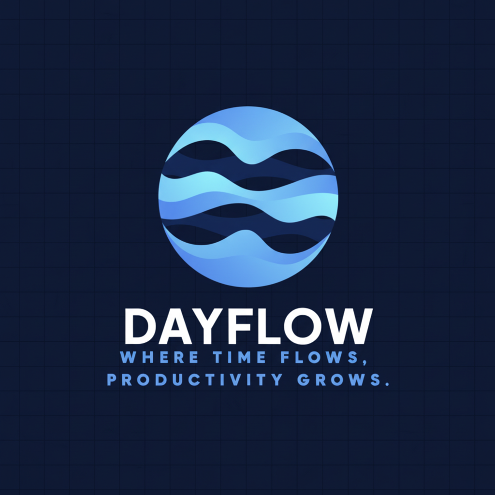
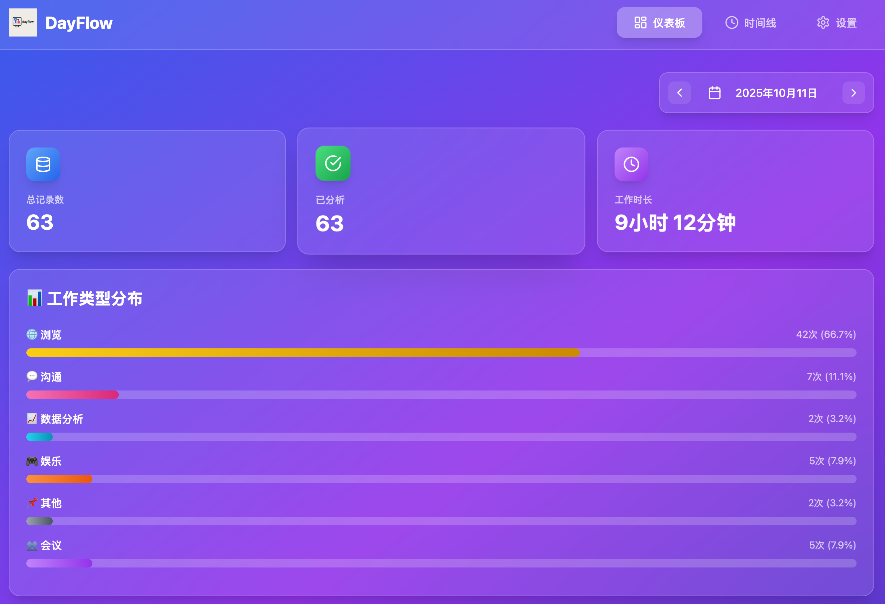
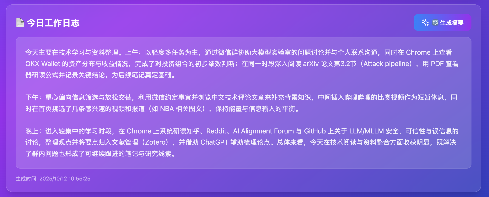
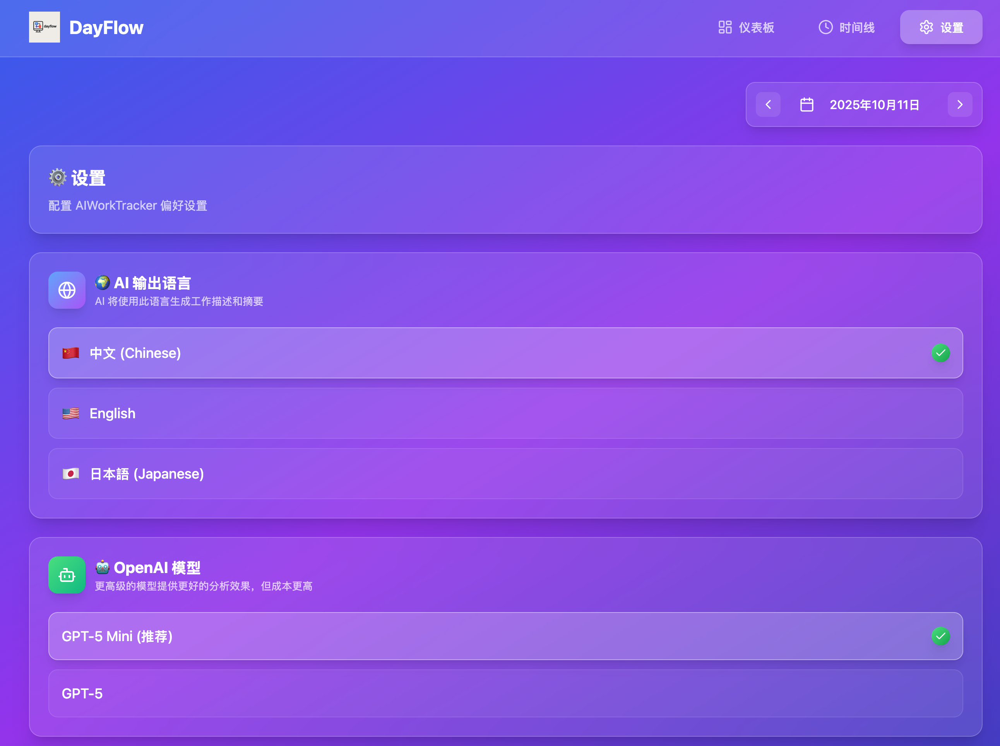

<div align="center">
  

  # DayFlow

  **AI 驱动的工作活动追踪器**

  自动监控电脑活动并通过 AI 生成工作日志的桌面应用

  [](https://opensource.org/licenses/MIT)
</div>

---
## 效果展示







## 快速启动

**前端运行**
```
npm run dev
```

**后端运行**
```
conda activate aiworktracker && python3 -m src.main
```

## 功能特性

- 🖥️ **自动监控**：智能截图，每10分钟记录一次工作状态
- 🤖 **AI 分析**：使用 OpenAI GPT 识别工作内容和类型
- 📊 **数据存储**：本地 SQLite 数据库保存分析结果
- 🔒 **隐私保护**：分析后自动删除截图，只保留文字描述
- ⏱️ **时间上下文**：基于最近活动智能判断工作连贯性

## 技术栈

- **后端**: Python + FastAPI + SQLAlchemy
- **前端**: React + Vite + Tailwind CSS
- **AI**: OpenAI GPT-4o-mini / GPT-5
- **监控**: mss + pynput + AppKit (macOS)

## 快速开始

### 1. 安装依赖

**后端:**
```bash
cd backend
pip install -r requirements.txt
```

**前端:**
```bash
cd frontend
npm install
```

### 2. 配置环境变量

创建 `.env` 文件：
```bash
cp .env.example .env
```

编辑 `.env`，填入你的 OpenAI API Key：
```
OPENAI_API_KEY=sk-your-api-key-here
OPENAI_MODEL=gpt-4o-mini
```

### 3. 运行监控

```bash
cd backend
python -m src.monitor.main_monitor
```

## 项目结构

```
aiworktracker/
├── backend/              # Python 后端
│   ├── src/
│   │   ├── monitor/     # 监控模块（截图、窗口追踪）
│   │   ├── ai/          # AI 分析模块
│   │   ├── database/    # 数据库模型和操作
│   │   └── api/         # FastAPI 路由
│   └── requirements.txt
├── frontend/             # React 前端
│   ├── src/
│   │   ├── components/  # UI 组件
│   │   └── services/    # API 调用
│   └── package.json
├── data/                 # 运行时数据（自动生成）
│   ├── screenshots/     # 临时截图
│   └── aiworktracker.db # SQLite 数据库
└── .env                 # 环境变量配置
```

## 工作流程

1. 监控线程每秒检查活跃窗口
2. 每10分钟自动截图一次
3. 立即调用 AI 分析截图内容
4. 保存分析结果到数据库
5. 删除截图文件（保护隐私）

## AI 分析示例

```json
{
  "category": "coding",
  "description": "继续开发 Python 后端，调试数据库查询功能",
  "confidence": 85,
  "details": {
    "tool_or_platform": "VSCode + Terminal",
    "task_continuity": "continuing"
  }
}
```

## License

MIT
